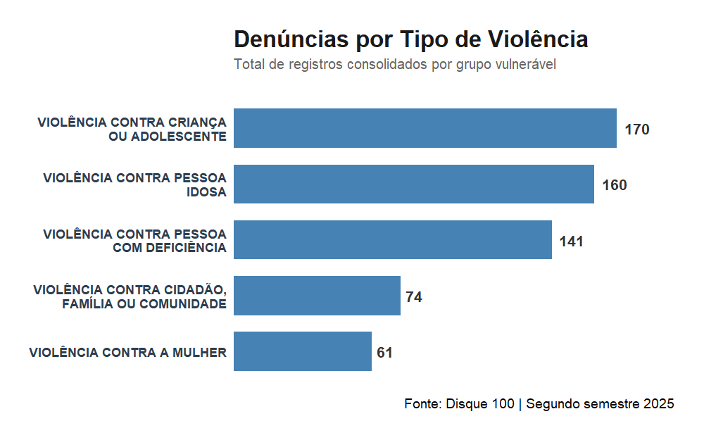
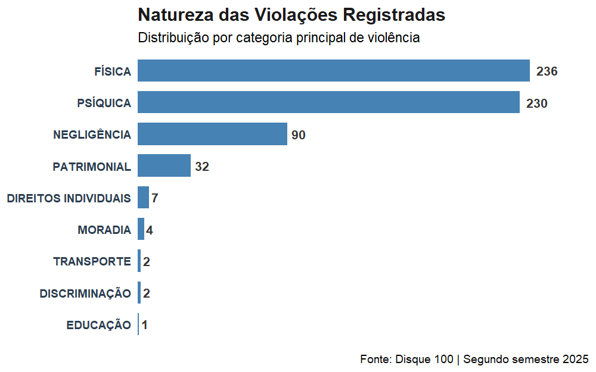
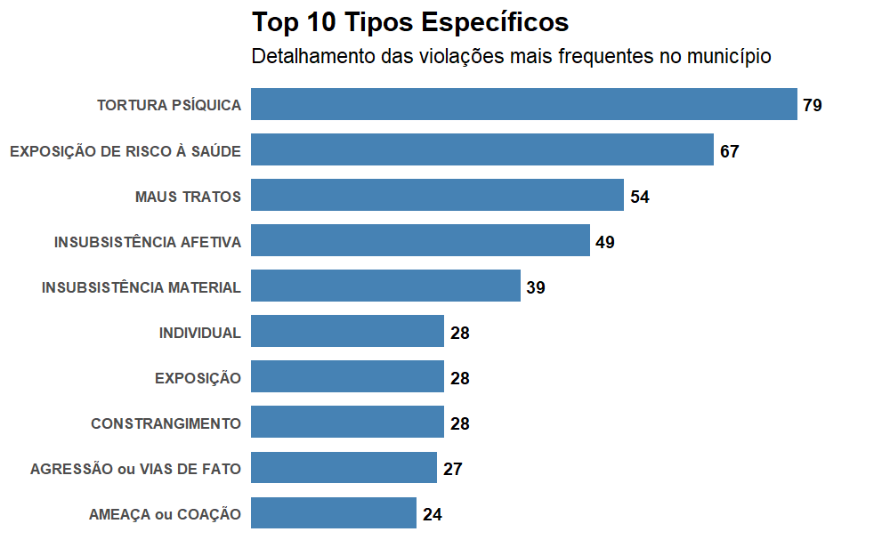
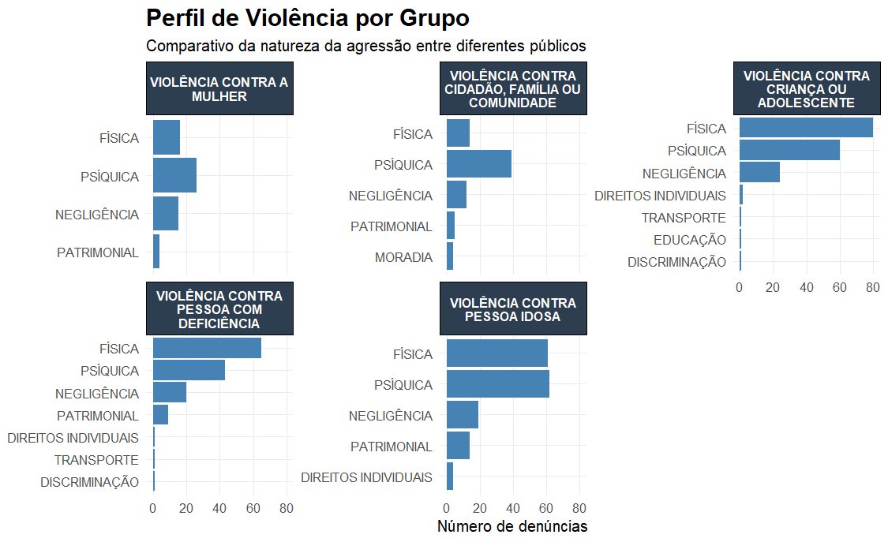
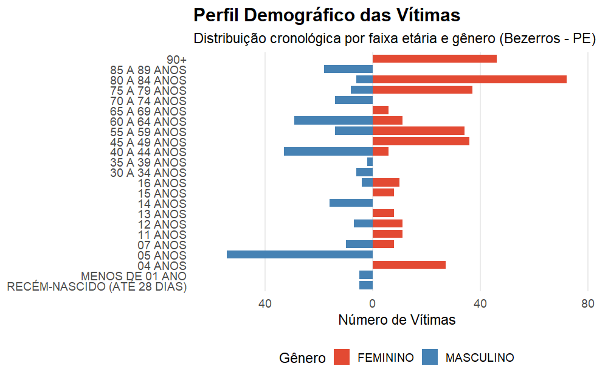
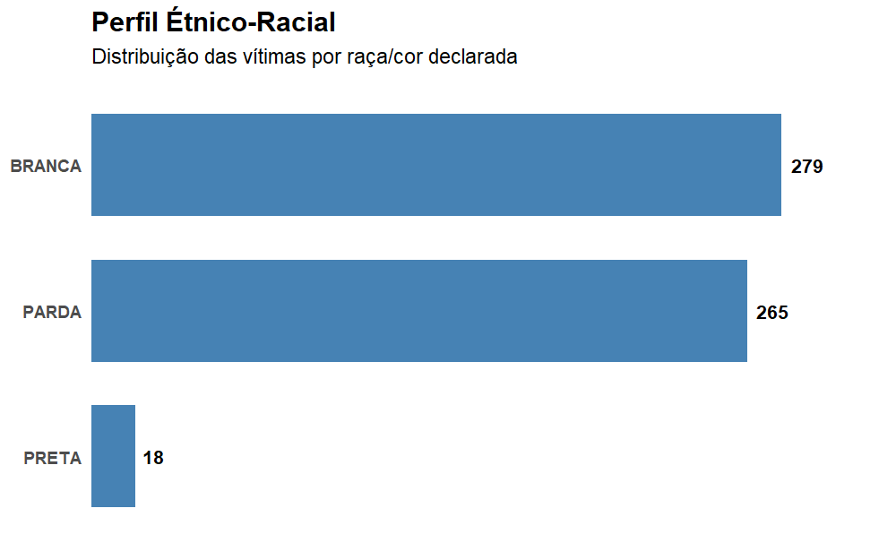
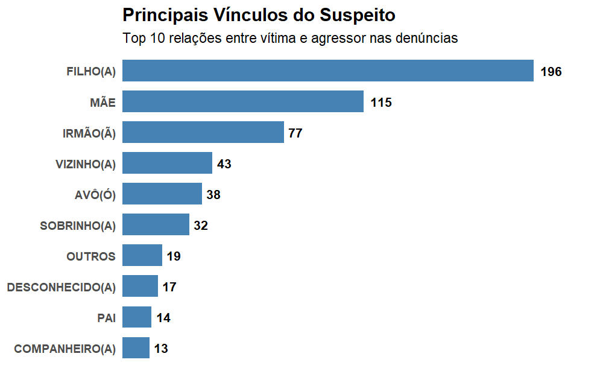
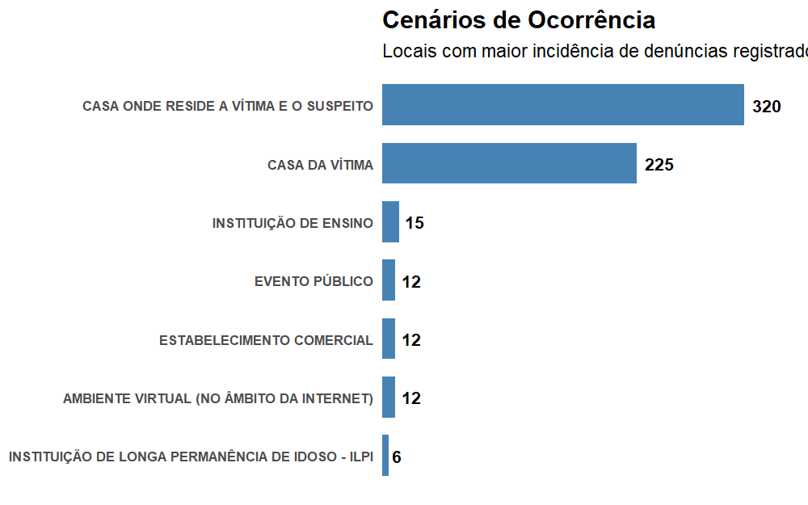

# 📊 Análise de Dados: Disque 100 – Direitos Humanos (Bezerros/PE)

> **Diagnóstico detalhado das denúncias de violações de direitos humanos registradas no 2º semestre de 2025.**

Este projeto apresenta uma análise exploratória das denúncias captadas pelo **Disque 100**, o principal canal do Governo Federal para o recebimento de relatos de violações de direitos humanos. O foco concentra-se no município de **Bezerros, Pernambuco**, transformando dados brutos em indicadores para o entendimento da dinâmica de vulnerabilidade local.

---

## 🎯 Objetivos da Análise

Diferente de estatísticas criminais tradicionais, o Disque 100 atua como um **indicador antecedente**, captando situações de vulnerabilidade muitas vezes antes de se tornarem boletins de ocorrência. Esta análise busca:

* Identificar os **grupos vulneráveis** com maior concentração de denúncias.
* Mapear a **natureza das violações** e os **cenários** onde ocorrem.
* Subsidiar o desenho de **políticas públicas de prevenção** baseadas em evidências.

---

## 🛠️ Ferramentas Utilizadas

O projeto foi desenvolvido em **Linguagem R**, utilizando o ecossistema `tidyverse` para garantir reprodutibilidade:

* **dplyr & tidyr**: Limpeza e manipulação de dados.
* **ggplot2**: Visualizações customizadas de alto impacto.
* **sidrar**: Integração com dados populacionais do IBGE.

---

## 📂 Metodologia e Dados

Os dados foram extraídos do portal de [Dados Abertos do MDH](https://www.gov.br/mdh/pt-br/acesso-a-informacao/dados-abertos/disque100).

* **Recorte Temporal:** 2º Semestre de 2025.
* **Volume Processado:** Base nacional de ~2,4 milhões de registros reduzida para **606 observações** após filtragem específica para Bezerros/PE.
* **Indicador de Incidência:** A taxa de denúncias foi calculada em **932,2 por 100 mil habitantes**, utilizando dados populacionais do IBGE 2025 via API do Sidra.

> [!IMPORTANT]
> **Nota Metodológica:** Os dados refletem denúncias registradas e estão sujeitos a subnotificação. Como dependem da propensão à denúncia, não devem ser interpretados como uma medida absoluta da criminalidade, mas sim como um termômetro da percepção e incidência de violações relatadas.
---

## 📊 Estrutura do Projeto e Tratamento de Dados

### 1. Seleção e Limpeza de Variáveis
Após a filtragem geográfica, realizou-se uma análise de completitude. As variáveis `Grau_de_instrução_da_vítima`, `Deficiência_da_vítima` e `Faixa_de_renda_da_vítima` foram **excluídas** devido ao índice de ausência de dados superior a 80%.

As variáveis finais utilizadas foram:
`Grupo_vulnerável`, `tipo` (natureza), `Cenário_da_violação`, `Faixa_etária_da_vítima`, `Gênero_da_vítima`, `Raça_Cor_da_vítima` e `Relação_vítima_suspeito`.

---

### 2. Principais Visualizações

Nesta seção, apresentamos os indicadores visuais consolidados para o município de Bezerros/PE, permitindo identificar os perfis de vulnerabilidade e a dinâmica das violações registradas.

#### 2.1 Distribuição por Grupo Vulnerável
O volume total de denúncias revela que crianças, adolescentes e pessoas idosas emergem como os públicos com maior concentração de registros no período analisado.

#### 2.2 Natureza e Tipos de Violações
A análise da natureza das agressões aponta que as violências de caráter **Físico** e **Psíquico** são as mais prevalentes. O detalhamento dos tipos específicos permite identificar vulnerabilidades acentuadas em cada grupo assistido.

#### 2.3 Perfil das Vítimas (Demografia e Etnia)
A pirâmide etária destaca picos críticos de vulnerabilidade, com atenção especial à primeira infância e à população idosa feminina. A ordenação cronológica foi ajustada para refletir a base da pirâmide (recém-nascidos) até o topo (90+).

#### 2.4 Vínculo Vítima-Suspeito e Cenário
Os dados confirmam que a violência no município é predominantemente **doméstica e intrafamiliar**. A maioria das agressões ocorre dentro da residência e é cometida por familiares com vínculos diretos (como filhos e mães).

---

### 3. Conclusão

O diagnóstico realizado rrevela um cenário de alta vulnerabilidade doméstica em Bezerros/PE, com uma taxa de **932,2 denúncias por 100 mil habitantes**. A predominância de agressores familiares dentro do ambiente residencial reforça a necessidade de fortalecer as redes de proteção locais (CRAS/CREAS) e promover canais de denúncia acessíveis e seguros para as vítimas.

---

## 🚀 Próximos Passos

* [ ] **Análise Espacial:** Realizar análise conjunta de cidades vizinhas do Agreste para identificar clusters de violência.
* [ ] **Cruzamento de Dados:** Comparar os índices do Disque 100 com indicadores socioeconômicos (IDH/IBGE).

---

## 🔗 Referências

* [Ministério dos Direitos Humanos e da Cidadania - Dados Abertos](https://www.gov.br/mdh/pt-br/acesso-a-informacao/dados-abertos/disque100)

